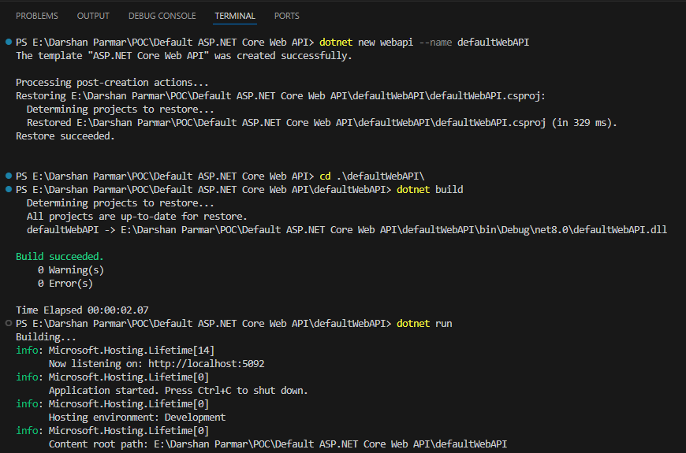
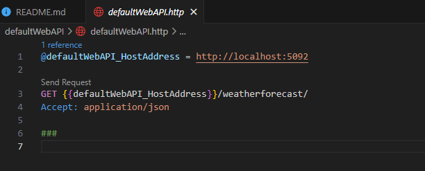
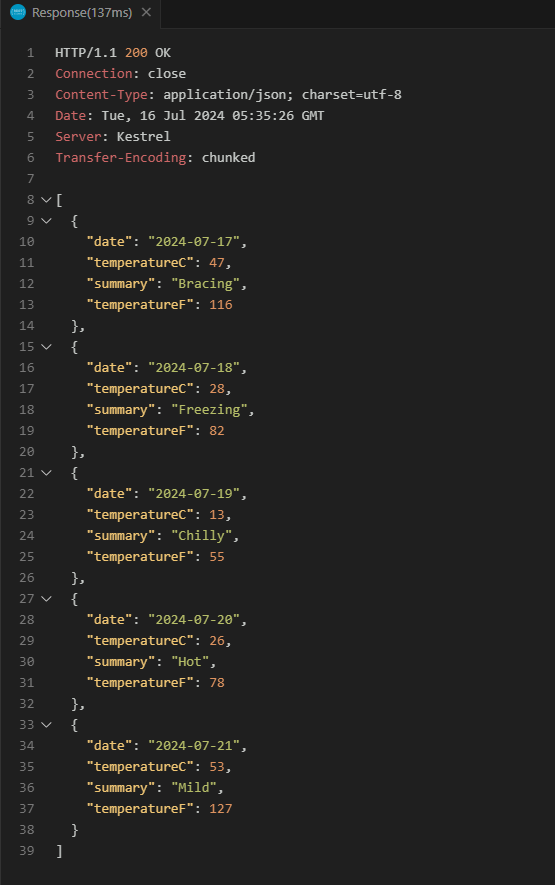

dotnet new webapi --name defaultWebAPI

cd .\defaultWebAPI\

dotnet build

dotnet run

*** launchsettings.json ***

This launchsettings.json file contains configuration settings for launching the application, such as environment variables and application URLs that will be used by .NET Core Framework when we run the application either from Visual Studio or by using .NET Core CLI.

Another point you need to remember is that the launchSettings.json file is only used within the local development machine. So, this file will not be required when we publish our ASP.NET Core Web API application on the production server.

*** appsettings.json ***

This file is used for configuration settings such as connection strings, API keys, logging settings, and custom configurations. It supports hierarchical data structures and can be overridden by environment-specific configuration files (e.g., appsettings.Development.json).

*** Program.cs ***

This is the entry point of your application. Here, it sets up the ASP.NET Core host, configures services, and the middleware pipeline settings for your application.

*** defaultWebAPI.http ***

The .http file, in an ASP.NET Core Web API project, is a feature provided by certain Integrated Development Environments (IDEs) like JetBrains Rider or Visual Studio Code, Visual Studio with the REST Client extension. These files are used to test HTTP requests directly from the IDE, which is particularly useful for testing and debugging APIs.

Structure

HTTP Requests: The file contains plain HTTP requests, which you can run directly from the IDE.
Syntax: It uses a simple syntax to define HTTP methods, URLs, headers, and body content.
Multiple Requests: You can define multiple requests in a single file, separated by a line of ###.

Visual Studio Code Extension : REST Client

How to Use?
First, run the application using the HTTP profile. Please ensure that the port number used to launch the application using the HTTP profile and the port number used in the .http file are the same. Once the application is running, then open the MyFirstWebAPIProject.http file and Click on the “Send Request” link that appears above the HTTP request in the IDE, as shown in the below image:

Once you click on the Send Request link, the responses are typically shown in a pane next to the request or in a separate window, allowing you to view the status code, response body, and headers, as shown in the image below.

Advantages

Convenience: Allows you to test API endpoints directly from the IDE without needing an external tool like Postman or Fiddler.
Version Control: This can be checked into source control, allowing team members to share and collaborate on API tests.
Documentation: Serves as a form of documentation of the API endpoints and their usage.

*** Swagger UI ***

http://localhost:5092/swagger/index.html
